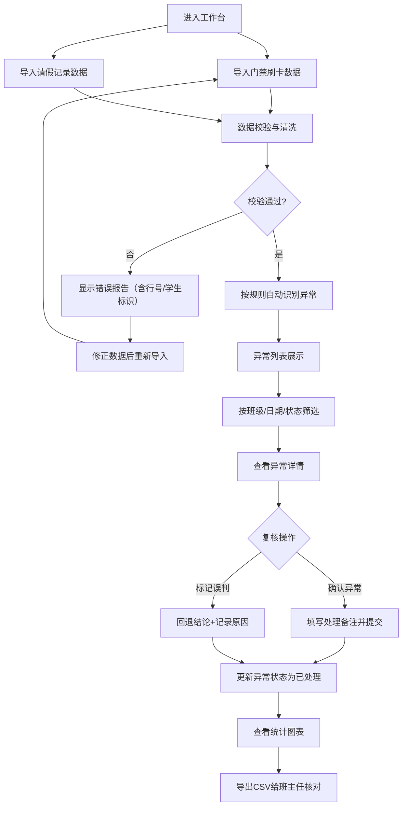

## 1. 产品概述

校园考勤异常分析工作台是一个面向教务管理人员和班主任的考勤数据智能分析系统，通过导入门禁刷卡和请假记录，按可配置规则自动识别迟到、缺勤、重复刷卡和请假例外等异常情况，提供人工复核、备注处理、误判回退等审核工作流，并支持统计图表和 CSV 导出供班主任核对。

- **目标用户**：教务管理员、年级主任、班主任
- **核心价值**：将繁琐的人工考勤核对转化为智能识别+人工审核的高效流程，确保考勤数据的准确性和可追溯性

## 2. 核心功能

### 2.1 用户角色

| 角色 | 核心权限 |
|------|----------|
| 教务管理员 | 数据导入、规则配置、全量异常审核、数据导出、系统设置 |
| 班主任 | 查看本班异常、复核本班异常、导出本班数据 |

### 2.2 功能模块

1. **数据导入页**：门禁刷卡记录导入、请假记录导入、样例数据加载、导入错误报告
2. **异常分析工作台**：异常列表（多条件筛选）、异常详情、复核操作、处理备注、误判回退、回退历史
3. **规则配置页**：年级阈值配置（迟到时间、缺勤判定时间窗口等）、规则版本管理、请假抵扣规则
4. **统计报表页**：异常趋势图表、班级/年级异常分布、导出汇总 CSV

### 2.3 页面详情

| 页面名称 | 模块名称 | 功能描述 |
|-----------|-------------|---------------------|
| 数据导入页 | 门禁刷卡导入 | 支持 CSV/Excel 导入，含字段映射、数据校验、行级错误提示 |
| 数据导入页 | 请假记录导入 | 支持 CSV/Excel 导入，含请假类型匹配、时间段校验 |
| 数据导入页 | 样例数据加载 | 一键加载演示用门禁和请假数据，便于体验全流程 |
| 数据导入页 | 错误报告面板 | 显示未知学生、非法时间、重复记录等错误，带行号和学生标识 |
| 异常分析工作台 | 异常筛选栏 | 按班级、日期范围、异常类型、处理状态、年级筛选 |
| 异常分析工作台 | 异常列表 | 展示异常记录，含学生信息、异常类型、时间、状态、操作按钮 |
| 异常分析工作台 | 异常详情抽屉 | 显示完整异常信息、刷卡原始记录、请假记录、审核历史 |
| 异常分析工作台 | 复核操作区 | 确认异常、标记误判、填写处理备注、提交审核 |
| 异常分析工作台 | 回退历史面板 | 展示该异常所有审核操作的时间线 |
| 规则配置页 | 年级阈值配置 | 每个年级独立配置：早读/上午/下午上课时间、迟到宽容分钟、缺勤判定窗口 |
| 规则配置页 | 规则版本列表 | 展示历史规则版本，支持回滚到指定版本 |
| 规则配置页 | 请假抵扣规则 | 配置请假类型是否抵扣对应异常（如病假抵扣缺勤） |
| 统计报表页 | 异常趋势图 | 按日/周/月展示各类型异常数量趋势折线图 |
| 统计报表页 | 班级异常分布图 | 柱状图展示各班级异常数量对比 |
| 统计报表页 | 导出功能 | 导出异常明细 CSV、班级汇总 CSV、全量统计数据 |

## 3. 核心流程

用户主流程：导入门禁和请假数据 → 系统自动识别异常 → 教务/班主任筛选并复核异常 → 填写处理备注或标记误判 → 查看统计图表 → 导出汇总给班主任核对

## 4. 用户界面设计

### 4.1 设计风格

- **主色调**：深蓝 #1e3a5f（教育行业专业感）+ 暖橙 #f97316（强调异常警示）
- **辅助色**：成功绿 #10b981、警告黄 #f59e0b、错误红 #ef4444
- **按钮风格**：圆角 8px，带微妙悬停阴影过渡
- **字体**：标题用思源宋体（正式感），正文用思源黑体（可读性）
- **布局风格**：顶部导航 + 左侧二级菜单 + 主内容区卡片式布局
- **图标风格**：lucide-react 线性图标，统一 20px 尺寸

### 4.2 页面设计概述

| 页面名称 | 模块名称 | UI 元素 |
|-----------|-------------|-------------|
| 数据导入页 | 拖拽上传区 | 虚线边框上传区域，文件图标，拖拽高亮动画 |
| 数据导入页 | 错误报告 | 红色警告卡片，错误列表分组显示，行号高亮 |
| 异常分析工作台 | 筛选栏 | 水平排列的下拉选择器和日期范围选择器，紧凑布局 |
| 异常分析工作台 | 异常列表 | 数据表格，斑马纹，异常类型色标标签，行悬停效果 |
| 异常分析工作台 | 详情抽屉 | 右侧滑出面板，分段信息展示，时间线式审核历史 |
| 规则配置页 | 年级配置卡 | 每个年级独立卡片，表单内联编辑，保存/取消按钮 |
| 统计报表页 | 图表区 | ECharts 图表卡片，带渐变填充和动画效果 |

### 4.3 响应式

桌面端优先设计（1280px 起），支持 1024px 平板适配，筛选栏在窄屏下自动换行。
