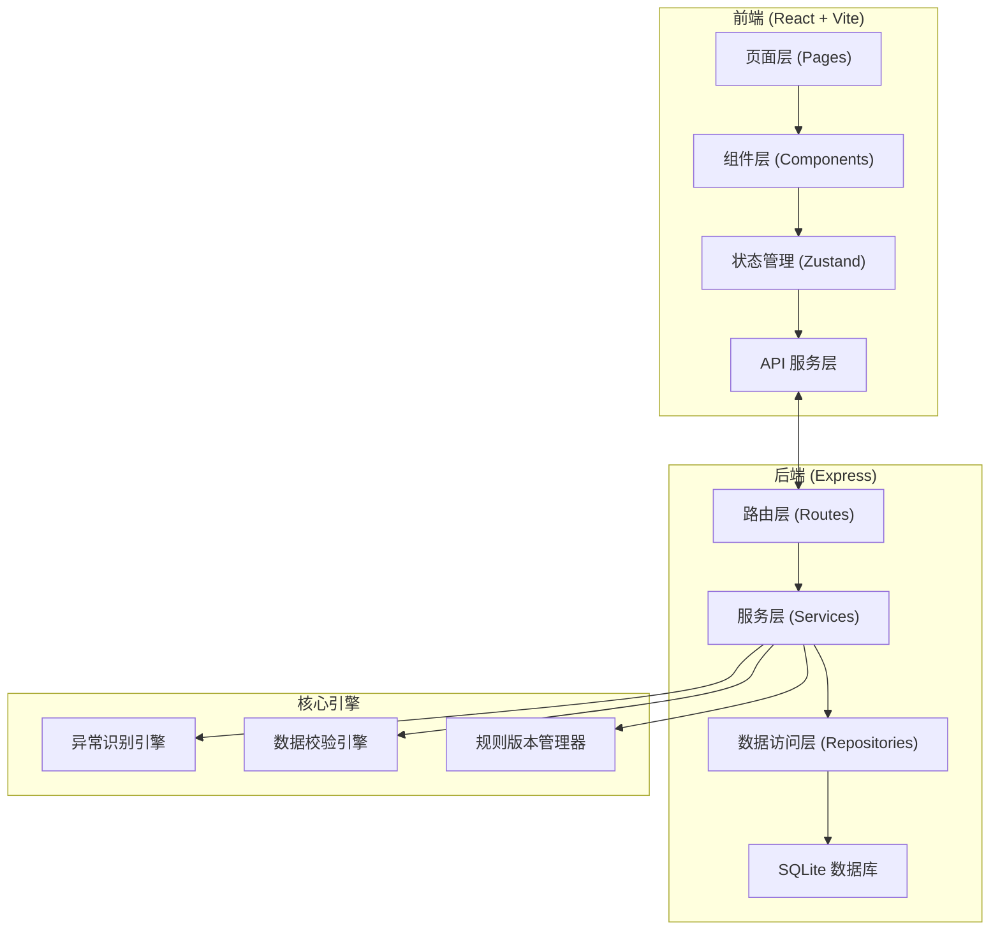
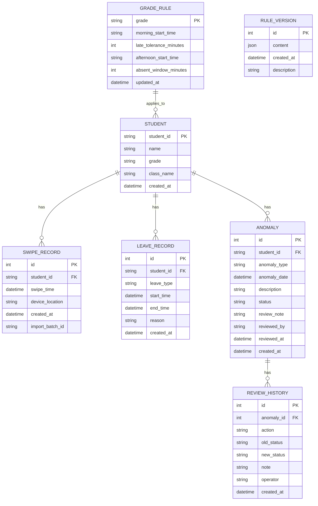

## 1. 架构设计



## 2. 技术描述

- **前端**: React@18 + TypeScript + tailwindcss@3 + Vite + zustand + react-router-dom + lucide-react + echarts
- **后端**: Express@4 + TypeScript + better-sqlite3
- **数据库**: SQLite（本地持久化，文件存储）
- **初始化工具**: vite-init
- **包管理**: npm

## 3. 路由定义

| 路由 | 页面组件 | 用途 |
|-------|---------|------|
| / | Dashboard | 工作台首页（快捷入口+概览统计） |
| /import | DataImport | 数据导入页面 |
| /anomalies | AnomalyWorkbench | 异常分析工作台 |
| /rules | RuleConfig | 规则配置页面 |
| /reports | Statistics | 统计报表页面 |

后端 API 路由：

| 路由 | 方法 | 用途 |
|-------|------|------|
| /api/students | GET/POST | 学生信息管理 |
| /api/swipe-records | GET/POST | 门禁刷卡记录管理 |
| /api/leave-records | GET/POST | 请假记录管理 |
| /api/anomalies | GET/PUT | 异常记录查询与审核 |
| /api/anomalies/:id/review | POST | 提交异常复核 |
| /api/anomalies/:id/revert | POST | 回退异常结论 |
| /api/anomalies/:id/history | GET | 获取异常审核历史 |
| /api/rules | GET/POST | 获取/保存当前规则 |
| /api/rules/versions | GET | 获取规则版本历史 |
| /api/rules/versions/:id | GET/POST | 获取指定版本/回滚到指定版本 |
| /api/import/validate | POST | 导入数据预校验（返回错误报告） |
| /api/import/commit | POST | 提交导入数据 |
| /api/import/sample | POST | 加载样例数据 |
| /api/export/anomalies | GET | 导出异常明细 CSV |
| /api/export/summary | GET | 导出班级汇总 CSV |
| /api/statistics/trend | GET | 获取异常趋势数据 |
| /api/statistics/distribution | GET | 获取班级分布数据 |

## 4. 数据模型

### 4.1 ER 图



### 4.2 DDL 语句

```sql
-- 学生信息表
CREATE TABLE IF NOT EXISTS students (
    student_id TEXT PRIMARY KEY,
    name TEXT NOT NULL,
    grade TEXT NOT NULL,
    class_name TEXT NOT NULL,
    created_at DATETIME DEFAULT CURRENT_TIMESTAMP
);

-- 门禁刷卡记录表
CREATE TABLE IF NOT EXISTS swipe_records (
    id INTEGER PRIMARY KEY AUTOINCREMENT,
    student_id TEXT NOT NULL,
    swipe_time DATETIME NOT NULL,
    device_location TEXT,
    import_batch_id TEXT,
    created_at DATETIME DEFAULT CURRENT_TIMESTAMP,
    FOREIGN KEY (student_id) REFERENCES students(student_id),
    UNIQUE(student_id, swipe_time)
);

-- 请假记录表
CREATE TABLE IF NOT EXISTS leave_records (
    id INTEGER PRIMARY KEY AUTOINCREMENT,
    student_id TEXT NOT NULL,
    leave_type TEXT NOT NULL,
    start_time DATETIME NOT NULL,
    end_time DATETIME NOT NULL,
    reason TEXT,
    created_at DATETIME DEFAULT CURRENT_TIMESTAMP,
    FOREIGN KEY (student_id) REFERENCES students(student_id)
);

-- 异常记录表
CREATE TABLE IF NOT EXISTS anomalies (
    id INTEGER PRIMARY KEY AUTOINCREMENT,
    student_id TEXT NOT NULL,
    anomaly_type TEXT NOT NULL,
    anomaly_date DATE NOT NULL,
    description TEXT,
    status TEXT NOT NULL DEFAULT 'pending',
    review_note TEXT,
    reviewed_by TEXT,
    reviewed_at DATETIME,
    created_at DATETIME DEFAULT CURRENT_TIMESTAMP,
    FOREIGN KEY (student_id) REFERENCES students(student_id)
);

-- 审核历史表
CREATE TABLE IF NOT EXISTS review_histories (
    id INTEGER PRIMARY KEY AUTOINCREMENT,
    anomaly_id INTEGER NOT NULL,
    action TEXT NOT NULL,
    old_status TEXT,
    new_status TEXT NOT NULL,
    note TEXT,
    operator TEXT,
    created_at DATETIME DEFAULT CURRENT_TIMESTAMP,
    FOREIGN KEY (anomaly_id) REFERENCES anomalies(id)
);

-- 年级规则表
CREATE TABLE IF NOT EXISTS grade_rules (
    grade TEXT PRIMARY KEY,
    morning_start_time TEXT NOT NULL DEFAULT '08:00',
    late_tolerance_minutes INTEGER NOT NULL DEFAULT 5,
    afternoon_start_time TEXT NOT NULL DEFAULT '14:00',
    absent_window_minutes INTEGER NOT NULL DEFAULT 120,
    updated_at DATETIME DEFAULT CURRENT_TIMESTAMP
);

-- 规则版本表
CREATE TABLE IF NOT EXISTS rule_versions (
    id INTEGER PRIMARY KEY AUTOINCREMENT,
    content JSON NOT NULL,
    description TEXT,
    created_at DATETIME DEFAULT CURRENT_TIMESTAMP
);

-- 应用状态持久化表（保存筛选条件、视图状态等）
CREATE TABLE IF NOT EXISTS app_state (
    key TEXT PRIMARY KEY,
    value JSON NOT NULL,
    updated_at DATETIME DEFAULT CURRENT_TIMESTAMP
);

-- 索引
CREATE INDEX IF NOT EXISTS idx_swipe_student_time ON swipe_records(student_id, swipe_time);
CREATE INDEX IF NOT EXISTS idx_leave_student_time ON leave_records(student_id, start_time, end_time);
CREATE INDEX IF NOT EXISTS idx_anomaly_date ON anomalies(anomaly_date);
CREATE INDEX IF NOT EXISTS idx_anomaly_status ON anomalies(status);
CREATE INDEX IF NOT EXISTS idx_anomaly_student ON anomalies(student_id);
```
